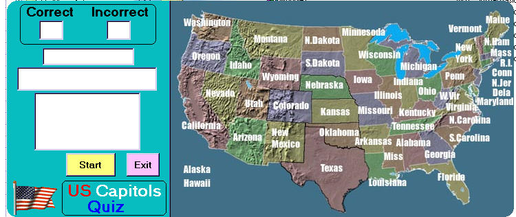



## US Capitols Quiz Update

### Description

Learn the US capitols.Fairly simple code. The non repeating random number generator section is not my code.I got it for PSC and it works great.I'm sure there is lots of room for improvement here,so feel free. Otherwise, enjoy.
 
### More Info
 
none that i know of

             |
---                |---
**Submitted On**   |2002-08-24 09:57:08
**By**             |[Kenneth Foster](https://github.com/Planet-Source-Code/PSCIndex/blob/master/ByAuthor/kenneth-foster.md)
**Level**          |Beginner
**User Rating**    |5.0 (15 globes from 3 users)
**Compatibility**  |VB 6\.0
**Category**       |[Complete Applications](https://github.com/Planet-Source-Code/PSCIndex/blob/master/ByCategory/complete-applications__1-27.md)
**World**          |[Visual Basic](https://github.com/Planet-Source-Code/PSCIndex/blob/master/ByWorld/visual-basic.md)
**Archive File**   |[US\_Capitol1220388242002\.zip](https://github.com/Planet-Source-Code/kenneth-foster-us-capitols-quiz-update__1-38202/archive/master.zip)

